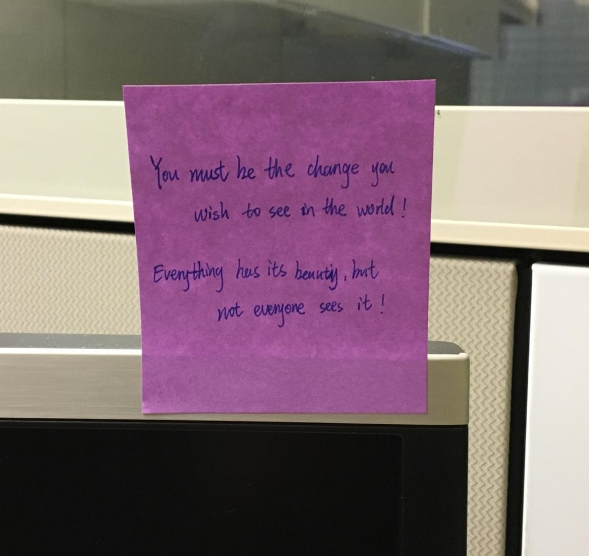

# Exploring AI Vision Services on Microsoft Azure

This repository contains my exploration and experimentation with Microsoft Azure's AI Vision Services. I tried out various tools and features to understand their capabilities and potential applications. Below are the key services I explored:

## AI Vision

I accessed the [Vision Studio](https://portal.vision.cognitive.azure.com/) and set a default resource to begin my experimentation.

### Face - Detect Faces in an Image

I used the Face API to detect faces within an image. It accurately identified and located the faces present in the provided image.

How it works:
- The Face API uses advanced machine learning algorithms to detect human faces in images.
- It can identify the location, size, and orientation of faces, as well as facial landmarks such as eyes, nose, and mouth.
- This technology can be applied in various scenarios, such as facial recognition, emotion analysis, and demographic analysis.

### Optical Character Recognition (OCR)

I utilized the OCR functionality to extract text from images. It successfully recognized and extracted the text content from the provided image.

How it works:
- OCR technology uses deep learning models to identify and extract text from images.
- It can handle various formats, including handwritten text, printed text, and text in different languages.
- OCR has numerous applications, such as digitizing documents, automating data entry, and enabling text search within images.

### Image Analysis

I explored the Image Analysis feature to automatically generate captions for images. It provided accurate and descriptive captions for the given image.

How it works:
- Image Analysis employs advanced computer vision techniques to understand the content of an image.
- It can identify objects, scenes, and activities within an image and generate human-readable descriptions.
- This technology has potential applications in areas like image search, content moderation, and accessibility.

## Insights and Possibilities

During my exploration of Azure's AI Vision Services, I gained valuable insights into the capabilities and potential of these technologies:

1. Facial analysis opens up possibilities for personalized experiences, sentiment analysis, and demographic insights.
2. OCR enables the digitization of physical documents, facilitating search, analysis, and automation of text-based processes.
3. Image captioning can enhance accessibility for visually impaired individuals and improve image search and retrieval systems.
4. The combination of these AI vision services can lead to powerful applications in industries such as healthcare, retail, security, and more.

I am excited to further explore and leverage these AI Vision Services in future projects and unlock new possibilities in computer vision and artificial intelligence.

Feel free to explore the code samples and examples provided in this repository to learn more about utilizing Azure's AI Vision Services in your own applications.
